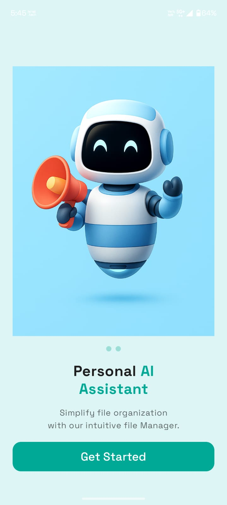
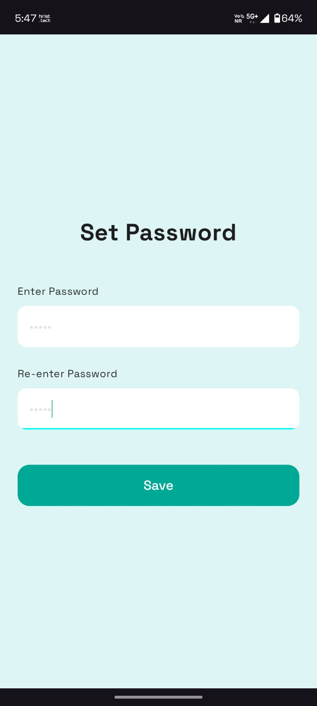
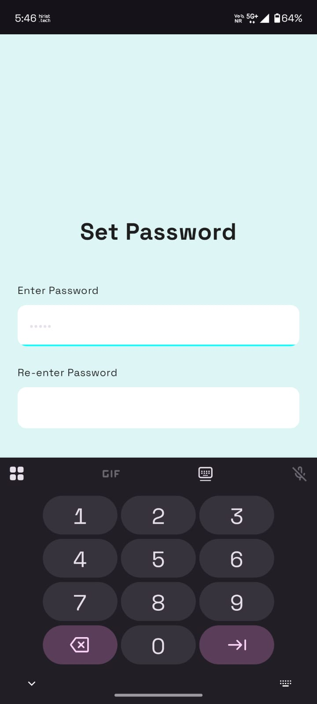
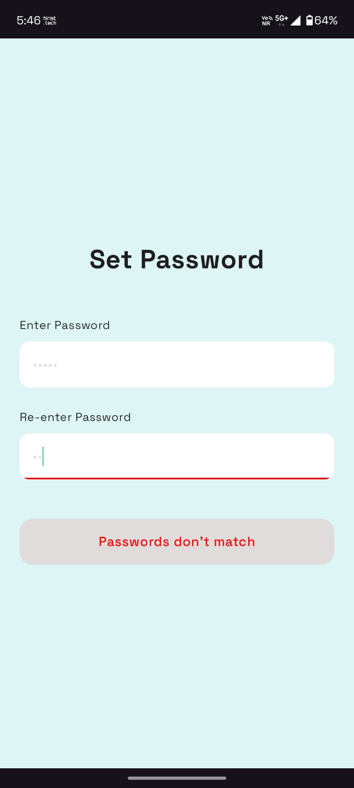
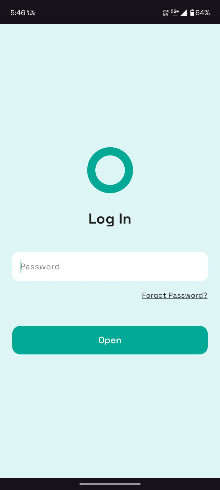
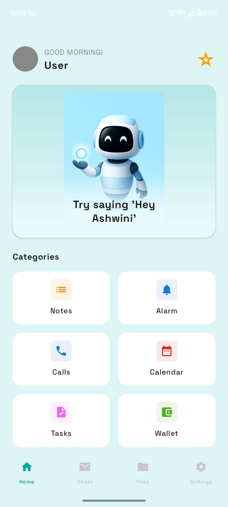

# ShreeTS Assignment

**Completion Date:** May 9th, 2026  
**Developer:** Sagar19176

## Description

This was an App assignment given by Shree Technological Services. This application demonstrates a
simple flow consisting of a login screen and a subsequent dashboard.

## Tech Stack

- **Language:** Kotlin (100%)
- **Platform:** Android

## Screenshots

<table>
  <tr>
    <th style="text-align: center;">Login Screen</th>
    <th style="text-align: center;">Set Password</th>
    <th style="text-align: center;">Numeric Input</th>
    <th style="text-align: center;">Validation</th>
    <th style="text-align: center;">Login</th>
    <th style="text-align: center;">Dashboard</th>
  </tr>
  <tr>
    <td align="center">
      
    </td>
    <td align="center">
      
    </td><td align="center">
      
    </td>
</tr>
<tr>
<td align="center">
      
    </td><td align="center">
      
    </td><td align="center">
      
    </td>
  </tr>
</table>

## Getting Started

1. Clone this repository.
2. Open the project in Android Studio.
3. Build and run the app on an emulator or physical Android device.